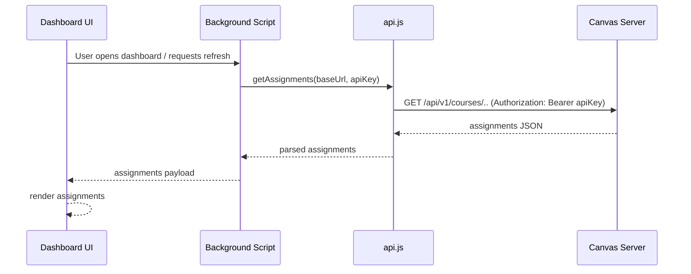
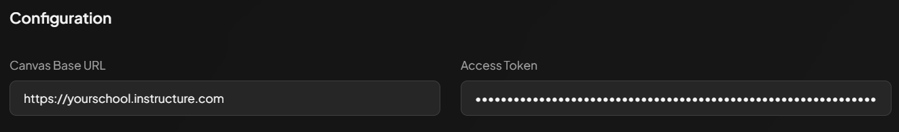
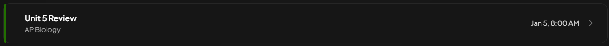
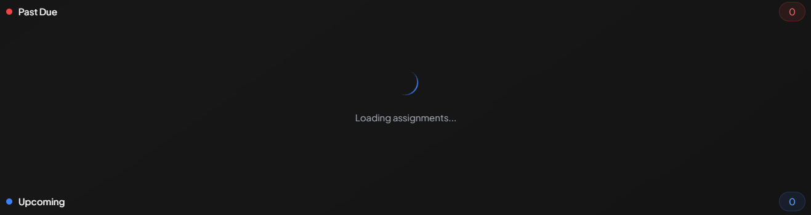
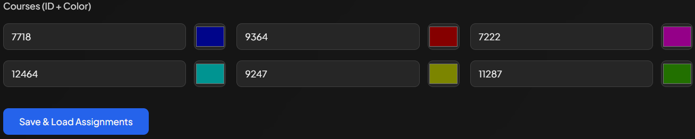

# Canvas Assignment Extension
My school district had replaced Teams as their online LMS with Canvas. Although Canvas is in my opinion a much better system,
I still missed some features from Teams, like the "Assignments" tab.

This essentially listed out every single assignment from every class, which was incredibly helpful for me to keep track
of my classes.

Inspired by this, I aimed to create a similar feature with this extension.

## Author
Avik Roy

## Features
Aggregates assignments from Canvas (project files show request/processing code).

## Requirements
Node.js and npm (for building Tailwind CSS)

## Install
1. Install dev dependencies:

   npm install

2. Build the CSS (uses Tailwind):

   npm run build-css

## Load extension (Chrome / Edge)
1. Open `chrome://extensions` (or `edge://extensions`).
2. Enable Developer mode.
3. Click "Load unpacked" and select this project folder.

## Project structure
- `manifest.json` — extension manifest
- `background.js` — background script
- `api.js` — Canvas API helper
- `dashboard.html` — UI
- `dashboard.js` — UI script
- `input.css` — Tailwind input
- `styles.css` — generated CSS (build output)

## Development
- Edit files and rebuild CSS with `npm run build-css` when you change styles.

## How it works
The extension requests assignment data from your school's Canvas instance using the Canvas REST API. You must provide:

- The Canvas base URL (`https://yourschool.instructure.com`)
- An API key (personal access token) from your Canvas account

These values are used by the extension's background script to call Canvas endpoints and aggregate assignments for the UI.

Security note: keep your API key private. Do not commit API keys to source control; store them in local extension settings or a secure vault.

## Preview

### Input fields

- Canvas base URL input and a hidden API key field. Required for the extension to work.

### Assignment (single)

- Example assignment card with a title, class name, and due date.

### Assignments list

- Past Due and Upcoming sections, with badges displaying count, and loading icon.

### Courses / Navigation

- 6 courses are currently supported, will change this later.
- Input fields for each course id, and color of each course for distinguishing assignments.
